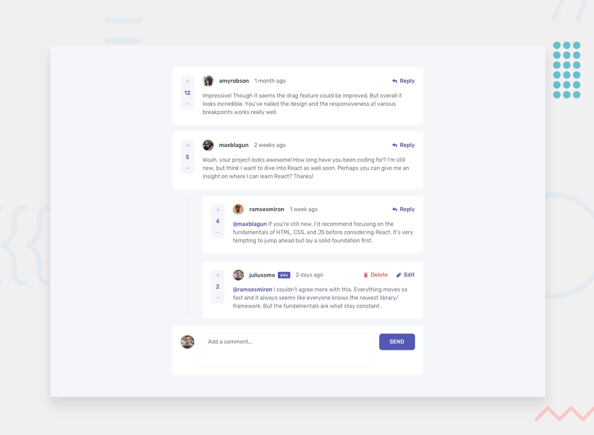

# Interactive Comments Section

A responsive **Interactive Comments Section** built with **React** and **Vite**. This project recreates the Frontend Mentor interactive comments interface and focuses on component-based UI development, state management, and interactive voting.



## Features

- Responsive comments layout for desktop and mobile screens
- Display comments and nested replies from local JSON data
- Upvote and downvote interactions for comments and replies
- Prevent repeated voting on the same reply
- Highlighted vote controls on focus
- Current-user identification with a **You** badge
- Different actions for the current user's replies
- Reusable React components for comments, replies, and the add-comment form
- Local avatar and icon assets
- Semantic and accessible button/image structure

## Built With

- **React 19**
- **Vite 8**
- **JavaScript (ES Modules)**
- **CSS3**
- **React Hooks** — `useState`
- **ESLint**

## Project Structure

```text
Interactive-Comments-Section/
├── public/                 # Public icons and assets
├── src/
│   ├── assets/             # Avatars and UI icons
│   ├── components/
│   │   ├── AddComment.jsx
│   │   ├── Comment.jsx
│   │   ├── CommentsPerUser.jsx
│   │   └── Reply.jsx
│   ├── App.jsx
│   ├── App.css
│   └── main.jsx
├── data.json               # Initial comments and user data
├── design/                 # Reference design images
├── preview.jpg             # Project preview
├── index.html
├── package.json
└── vite.config.js
```

## Getting Started

### 1. Clone the repository

```bash
git clone https://github.com/atef7534/Interactive-Comments-Section.git
cd Interactive-Comments-Section
```

### 2. Install dependencies

```bash
npm install
```

### 3. Start the development server

```bash
npm run dev
```

Open the local URL provided by Vite in your browser.

## Available Scripts

| Command | Description |
| --- | --- |
| `npm run dev` | Starts the Vite development server |
| `npm run build` | Creates a production build |
| `npm run preview` | Previews the production build locally |
| `npm run lint` | Runs ESLint |

## What I Practiced

This project was built to strengthen practical React skills, including:

- Breaking a UI into reusable components
- Passing data and callbacks through props
- Managing component state with `useState`
- Updating arrays immutably with `map()`
- Rendering lists with stable keys
- Handling conditional rendering
- Managing independent state for individual replies
- Building responsive layouts with CSS

## Current Scope

The project currently focuses on the comments interface and voting interactions. The **Add Comment**, **Reply**, **Edit**, and **Delete** controls are represented in the UI, while their full data-persistence behavior is not yet implemented.

## Author

**Atif Yasser**

- GitHub: [@atef7534](https://github.com/atef7534)
- LinkedIn: [Atif Yasser](https://www.linkedin.com/in/atif-yasser/)

## Acknowledgments

- [Frontend Mentor](https://www.frontendmentor.io/) for the original challenge and design reference.
- [Vite](https://vite.dev/) for the development tooling.
- [React](https://react.dev/) for the UI library.
